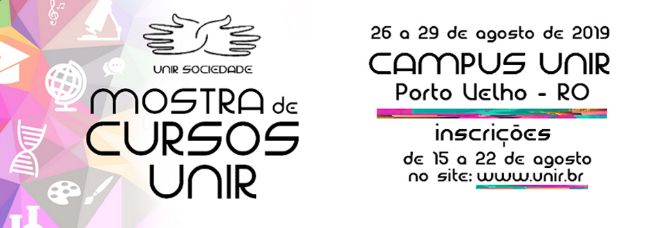
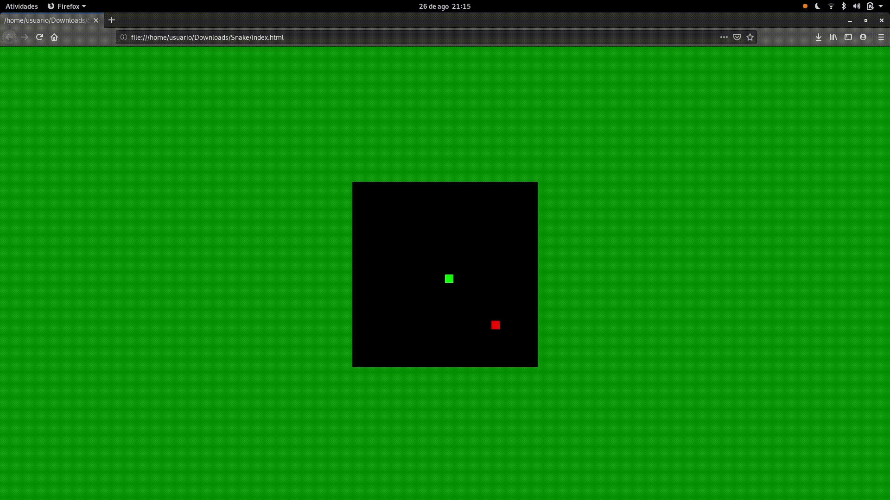

# Minicurso HTML

Este repositório foi desenvolvido para utilização no minicurso de Demonstração de Programação Web. Minicurso disponibilizado pelos acadêmicos do curso de Ciências da Computação que visa dar continuidade o projeto desenvolvido pela Pró-Reitoria de Cultura, Extensão e Assuntos Estudantis (PROCEA) da Universidade Federal de Rondônia (UNIR). O projeto que tem como missão institucional contribuir com à produção e difusão do conhecimento, considerando as peculiaridades amazônicas, visando o desenvolvimento da sociedade lançado o Programa UNIR SOCIEDADE: Mostra de Cursos.

 

Abaixo segue o resultado final do projeto.

Agradecimento a [Chris DeLeon](https://hometeamgamedev.com/) por disponibilizar o código.
